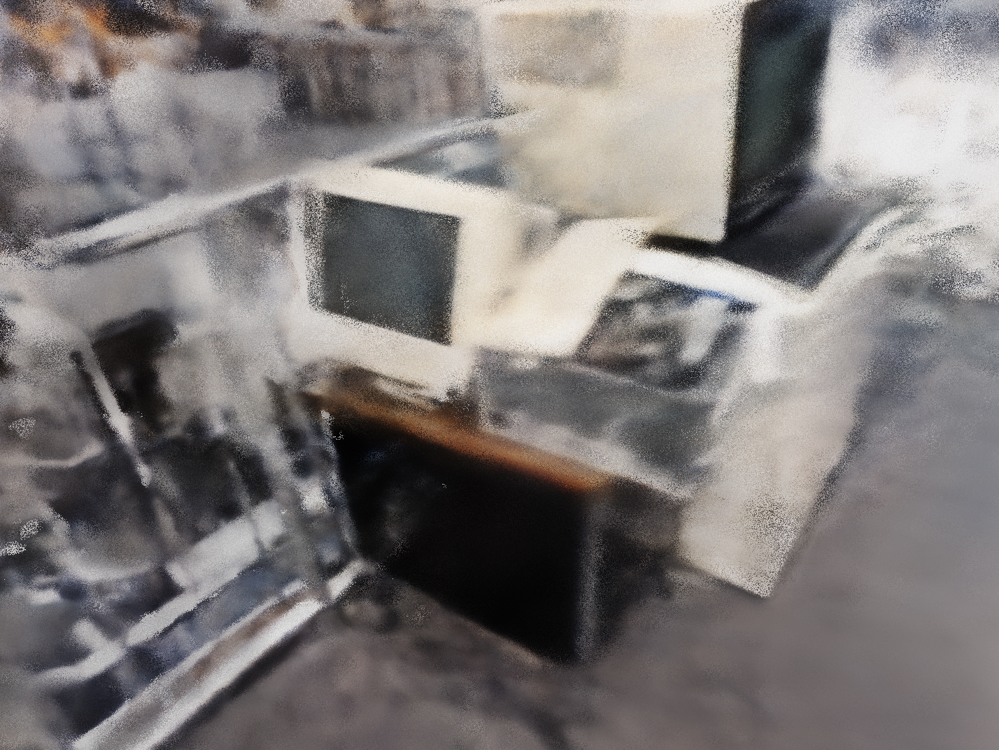

# A small NeRF implementaion

</img>

```
conda env create -f environment.yml
```

or

```
pip install torch numpy tqdm matplotlib tensorboard imageio
```

You can change the paramteres in the main file to run NeRF on your own scenes. We avoid using heirarichal sampling because there wasn't a very significant growth in the PSNR scores with the heirarical sampling, as can be seen in the results section of the original paper.

To create your own dataset, follow the link <a href="https://github.com/fyusion/llff">here</a>
